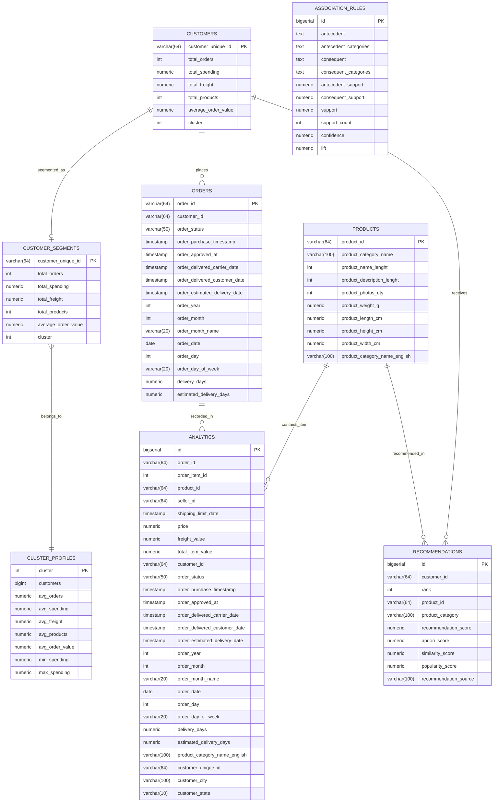

# Shoplytics Relational Schema & Entity-Relationship Model

## Database Overview
- **Database Engine**: PostgreSQL 17
- **Database Name**: `shoplytics`
- **Design Pattern**: Serving & Analytical Layer for E-Commerce Big Data Platform

---

## Entity-Relationship Diagram (Mermaid)

---

## Table Relationships & Cardinality

1. **`customers` to `orders`**: 1-to-many relationship (one unique customer can place multiple orders).
2. **`customers` to `customer_segments`**: 1-to-1 relationship linking customer profile to their assigned K-Means cluster.
3. **`cluster_profiles` to `customer_segments`**: 1-to-many relationship mapping cluster IDs to their segment profile aggregate stats.
4. **`customers` / `products` to `recommendations`**: Personalized recommendations generated per customer referencing recommended products.
5. **`analytics`**: Denormalized analytical line-item data combining order transactions, items, categories, customer locations, and fulfillment metrics.
6. **`association_rules`**: Cross-product association rules generated by Apriori algorithm with support, confidence, and lift metrics.
