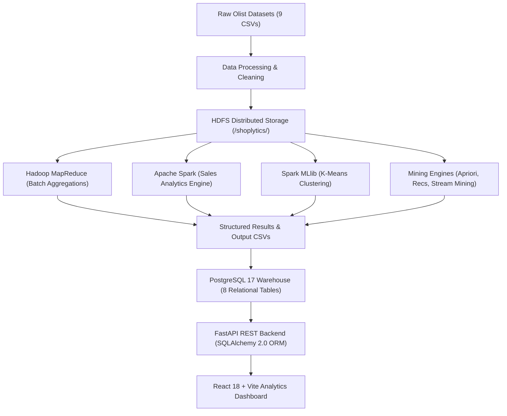

# Shoplytics End-to-End Data Flow Specification 🔄

## 1. Data Flow Overview

This document describes the chronological end-to-end data lifecycle in **Shoplytics**, tracking data transformations from initial raw ingestion to distributed analytical processing, machine learning modeling, relational warehousing, API serving, and reactive visualization.

```text
  [ Raw CSV Ingestion ] ──────► [ Data Cleansing & Normalization ]
                                                │
                                                ▼
  [ React Analytics Dashboard ] ◄───── [ Distributed HDFS Storage ]
              ▲                                 │
              │                                 ├────────────────────────┐
   [ FastAPI REST API ]                         ▼                        ▼
              ▲                        [ MapReduce Jobs ]       [ Apache Spark ]
              │                                 │                        │
  [ PostgreSQL 17 Warehouse ] ◄─────────────────┴────────────────────────┤
              ▲                                                          │
              │                                                          ▼
  [ Algorithm Artifacts ] ◄──────────────────────────────────── [ ML & Mining Engines ]
  (Apriori, K-Means, Recommendations)
```

---

## 2. Detailed Pipeline Stages



---

## 3. Component Responsibility Matrix

| Pipeline Phase | Primary Technology | Component Classification | Primary Responsibility |
| :--- | :--- | :--- | :--- |
| **Phase 1: Raw Ingestion** | Local Filesystem / CSV | **Storage** | Houses 9 raw e-commerce CSV files (orders, customers, products, payments, etc.). |
| **Phase 2: Cleansing & ETL** | Python Pandas / Standard Library | **Processing** | Standardizes column schemas, normalizes timestamps, cleans currency values, produces `data/processed/*.csv`. |
| **Phase 3: Distributed Storage** | Apache Hadoop HDFS 3.3.6 | **Storage** | Distributed resilient block storage on `/shoplytics/raw`, `/shoplytics/processed`, `/shoplytics/results`. |
| **Phase 4: Distributed Computing** | Hadoop MapReduce | **Processing & Analytics** | Streaming Mappers and Reducers executing distributed order revenue and category aggregations. |
| **Phase 5: In-Memory Computing** | Apache Spark 3.5.6 | **Analytics** | In-memory DAG computation for sales breakdowns, monthly growth trends, and seller performance. |
| **Phase 6: Machine Learning** | Spark MLlib | **Machine Learning** | 4-Cluster K-Means unsupervised clustering on customer feature matrices (`total_spending`, `total_orders`, `AOV`). |
| **Phase 7: Association Mining** | Apriori Algorithm | **Analytics & Mining** | Frequent itemset discovery producing 91 association rules parameterized by support, confidence, and lift. |
| **Phase 8: Recommendation Engine**| Hybrid Collaborative & Content | **Recommendation** | Generates top-10 personalized product suggestions per customer based on historical and category affinity. |
| **Phase 9: Stream Mining** | Bloom Filter, DGIM, Flajolet-Martin | **Stream Analytics** | Real-time probabilistic membership testing, distinct element counting, and sliding window bit counting. |
| **Phase 10: Relational Warehouse**| PostgreSQL 17 | **Storage & Indexing** | Relational warehouse storing 8 tables with B-Tree indexes for sub-5ms low-latency query reads. |
| **Phase 11: Serving Layer** | FastAPI 0.115+ (Python 3.13) | **Serving** | REST API layer exposing 25+ typed JSON endpoints with SQLAlchemy 2.0 connection pooling. |
| **Phase 12: Visualization Layer** | React 18, Vite 8, Tailwind, Recharts | **Visualization** | 8 interactive dashboard pages rendering real-time KPI metrics, responsive charts, and customer drill-downs. |

---

## 4. End-to-End Data Transformation Walkthrough

### 1. Ingestion & Preprocessing
- Raw Olist transactional records are ingested from `data/raw/`.
- Cleansing scripts resolve missing values in product category translations (`product_category_name_english`), standardizes dates into ISO formats, and generates clean datasets in `data/processed/`.

### 2. Distributed Execution in Hadoop & Spark
- Preprocessed datasets (e.g. `order_items_clean.csv`, `customer_features.csv`) are loaded into HDFS at `/shoplytics/processed/`.
- **MapReduce** runs Python streaming jobs:
  - `order_revenue_mapper.py` $\rightarrow$ `order_revenue_reducer.py`: Maps order line items and calculates gross revenue and item counts.
  - `category_sales_mapper.py` $\rightarrow$ `category_sales_reducer.py`: Aggregates category-level revenues and volumes.
- **Spark Analytics** reads from HDFS and computes multi-dimensional aggregations, product rankings, and monthly sales trends.

### 3. Machine Learning & Mining
- **Spark MLlib** clusters 95,420 customers into 4 clusters based on spending and order frequency, outputting `customer_segments/` and `cluster_profiles/`.
- **Apriori Algorithm** analyzes customer shopping baskets to discover cross-sell rules with high lift.
- **Hybrid Recommendation Engine** builds personalized top-10 recommendation lists for each customer ID.

### 4. Database Ingestion & Indexing
- `database/postgresql_loader.py` reads all processed files and algorithm outputs into PostgreSQL 17.
- Tables (`customers`, `products`, `orders`, `analytics`, `customer_segments`, `cluster_profiles`, `recommendations`, `association_rules`) are populated and indexed.

### 5. Serving via FastAPI Backend
- FastAPI routers query PostgreSQL using parameterized SQLAlchemy ORM sessions.
- Pydantic models validate and serialize responses with sub-10ms latency.

### 6. Interactive React Frontend
- React components query FastAPI via Axios (`frontend/src/services/api.js`).
- State is managed reactively and visualized via Recharts area charts, bar charts, and pie charts across 8 views.
